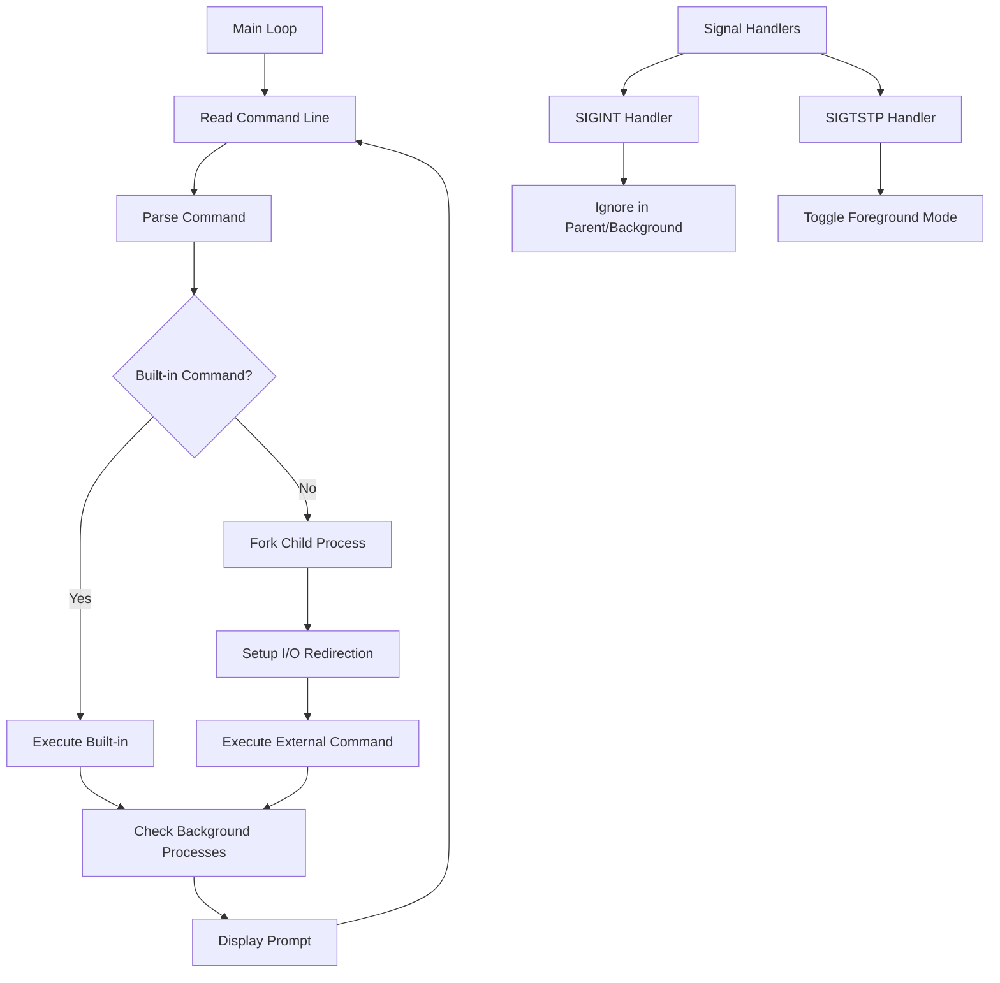

# Design Document

## Overview

The smallsh shell is designed as a single-threaded, event-driven command-line interpreter that manages processes, handles I/O redirection, and responds to signals. The architecture follows a main loop pattern where the shell continuously reads commands, parses them, and executes them either as built-in commands or external processes.

The design emphasizes modularity with separate components for command parsing, process management, I/O redirection, and signal handling. Memory management is carefully controlled to prevent leaks, and error handling is robust throughout all components.

## Architecture



The shell operates in a continuous loop, processing one command at a time. Signal handlers run asynchronously and can modify global state (like foreground-only mode) that affects command execution.

## Components and Interfaces

### 1. Command Parser
**Purpose:** Parse raw command line input into structured command data

**Interface:**
```c
typedef struct {
    char* command;           // Command name
    char* args[513];         // Arguments (max 512 + NULL terminator)
    char* input_file;        // Input redirection file
    char* output_file;       // Output redirection file
    int background;          // 1 if background, 0 if foreground
} command_t;

int parse_command(char* line, command_t* cmd);
void free_command(command_t* cmd);
```

**Responsibilities:**
- Tokenize input line respecting space-separated tokens
- Identify redirection operators (<, >) when surrounded by spaces
- Detect background operator (&) when it's the last token
- Handle comments (lines starting with #) and blank lines
- Validate command length (2048 chars) and argument count (512 max)

### 2. Built-in Command Handler
**Purpose:** Execute shell built-in commands

**Interface:**
```c
typedef enum {
    BUILTIN_EXIT,
    BUILTIN_CD,
    BUILTIN_STATUS,
    NOT_BUILTIN
} builtin_type_t;

builtin_type_t get_builtin_type(const char* command);
int execute_builtin(command_t* cmd, int* last_status);
```

**Responsibilities:**
- Identify built-in commands (exit, cd, status)
- Execute cd with proper directory resolution ($HOME handling)
- Maintain and report last command status
- Handle exit with background process cleanup

### 3. Process Manager
**Purpose:** Manage foreground and background process execution

**Interface:**
```c
typedef struct {
    pid_t pid;
    int active;
} bg_process_t;

int execute_external_command(command_t* cmd, int* last_status, int foreground_only);
void check_background_processes(void);
void cleanup_all_background_processes(void);
```

**Responsibilities:**
- Fork child processes for external commands
- Set up process groups for signal handling
- Track background processes in a global array
- Check for completed background processes using WNOHANG
- Print completion messages for finished background processes
- Handle foreground process waiting and status collection

### 4. I/O Redirection Handler
**Purpose:** Set up file redirection in child processes

**Interface:**
```c
int setup_io_redirection(command_t* cmd, int is_background);
```

**Responsibilities:**
- Open files for input/output redirection using appropriate modes
- Use dup2() to redirect stdin/stdout file descriptors
- Handle /dev/null redirection for background processes
- Provide error reporting for failed file operations
- Close original file descriptors after redirection

### 5. Signal Handler
**Purpose:** Handle SIGINT and SIGTSTP signals appropriately

**Interface:**
```c
void setup_signal_handlers(void);
void sigtstp_handler(int sig);
// SIGINT uses SIG_IGN for parent and background children
```

**Responsibilities:**
- Install signal handlers for parent process
- Toggle foreground-only mode on SIGTSTP
- Ensure proper signal inheritance in child processes
- Print mode change messages to stdout

## Data Models

### Global State
```c
// Background process tracking
static bg_process_t background_processes[MAX_BG_PROCESSES];
static int bg_process_count = 0;

// Shell state
static int foreground_only_mode = 0;
static int last_exit_status = 0;
static int last_signal = 0;
```

### Command Structure
The `command_t` structure encapsulates all parsed command information:
- Dynamic memory allocation for command and arguments
- Separate fields for I/O redirection files
- Background execution flag
- Proper cleanup function to prevent memory leaks

### Process Tracking
Background processes are tracked in a fixed-size array with:
- Process ID for waitpid() calls
- Active flag to mark completed processes
- Compact representation for efficient iteration

## Error Handling

### Input Validation
- Command line length validation (2048 character limit)
- Argument count validation (512 argument limit)
- File existence and permission checks for I/O redirection
- Memory allocation failure handling

### Process Execution Errors
- Fork failure handling with appropriate error messages
- Exec failure handling with status code 1 and child termination
- File redirection failures with error messages and status codes
- Signal handling errors (though signals are generally reliable)

### Memory Management
- All dynamically allocated memory is freed in error paths
- Command structure cleanup function prevents leaks
- No persistent memory allocations (everything freed each iteration)

### Error Reporting Strategy
- Print error messages to stderr for user visibility
- Set appropriate exit status codes (1 for errors, 0 for success)
- Continue shell operation after non-fatal errors
- Graceful degradation when possible (e.g., ignore malformed commands)

## Testing Strategy

### Unit Testing Approach
1. **Command Parser Tests**
   - Valid command parsing with various argument counts
   - I/O redirection parsing with different file names
   - Background operator detection in various positions
   - Comment and blank line handling
   - Edge cases: maximum arguments, maximum line length

2. **Built-in Command Tests**
   - cd command with no arguments (HOME directory)
   - cd command with relative and absolute paths
   - cd command with invalid directories
   - status command before and after various command executions
   - exit command behavior

3. **Process Management Tests**
   - Foreground process execution and waiting
   - Background process execution without waiting
   - Background process completion detection
   - Process cleanup on shell exit
   - Foreground-only mode behavior

4. **I/O Redirection Tests**
   - Input redirection from existing files
   - Input redirection from non-existent files
   - Output redirection to new and existing files
   - Combined input and output redirection
   - Background process /dev/null redirection

5. **Signal Handling Tests**
   - SIGINT behavior in parent, foreground, and background processes
   - SIGTSTP toggling of foreground-only mode
   - Signal inheritance in child processes
   - Mode change message printing

### Integration Testing
- End-to-end command execution scenarios
- Complex command combinations with redirection and background execution
- Signal handling during various shell states
- Memory leak detection using valgrind
- Stress testing with maximum arguments and line lengths

### Test Environment Setup
- Use temporary directories for file I/O tests
- Mock external commands for predictable testing
- Capture stdout/stderr for message verification
- Use shell scripts to automate test scenarios
- Test on target compilation environment (GNU99)